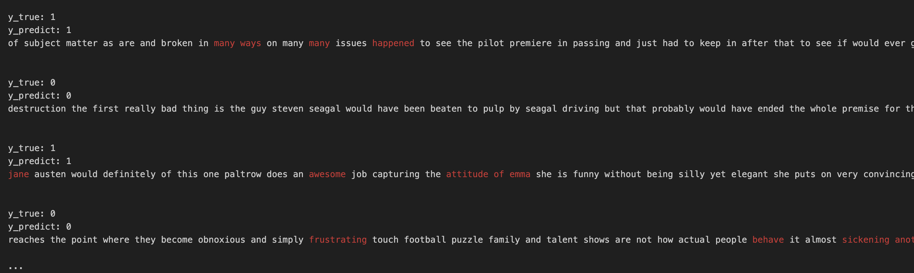

# Sentiment Analysis and Classification on IMDB Movie Reviews

## Overview

This project focuses on sentiment analysis and classification of IMDB movie reviews. The goal of the project was to develop an efficient model for sentiment analysis using GRU (Gated Recurrent Unit) for encoding input sequences and an attention mechanism to focus on key information during decoding. Additionally, attention weights were visualized to gain insights into the model's decision-making process, enhancing interpretability and understanding of the sentiment analysis results.

## Techniques Used

- GRU (Gated Recurrent Unit): Leveraged GRU for efficient encoding of input sequences in the sentiment analysis task.

- Attention Mechanism: Incorporated an attention mechanism in the decoding phase to focus on key information and improve the model's performance.

## Key Contributions

1. Efficient Sentiment Analysis: Utilized GRU to efficiently encode input sequences, allowing the model to handle long sequences of text efficiently.

2. Enhanced Interpretability: Visualized attention weights to gain insights into the model's decision-making process, providing a clearer understanding of how the sentiment analysis is performed.

## Results

The sentiment analysis model achieved impressive accuracy and performance on the IMDB movie reviews dataset. The attention mechanism provided valuable insights into the model's decision-making process, allowing for better interpretability and understanding of the sentiment predictions.
